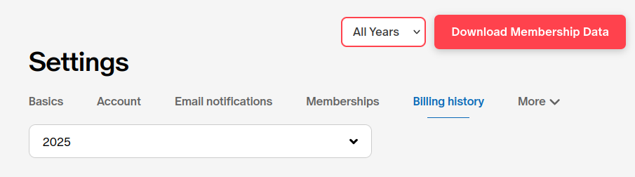

# Patreon Membership History Exporter

Patreon makes it very difficult to see how much you've spent on each creator over time. 
You have to click through multiple pages, and can only see a single charge at a time, which can include multiple creators.

This is a simple extension that exports your spending data to a simple CSV file.

## Links

Mozilla Addons: https://addons.mozilla.org/en-US/firefox/addon/patreon-membership-exporter/

Chrome Web Store: https://chrome.google.com/webstore/detail/dkkgpbidjmghhehnkaabaeemofmndklg

## Screenshots

  
  
  

